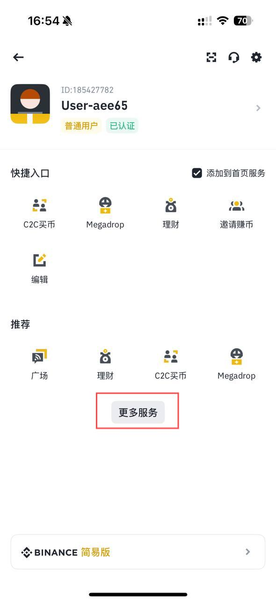
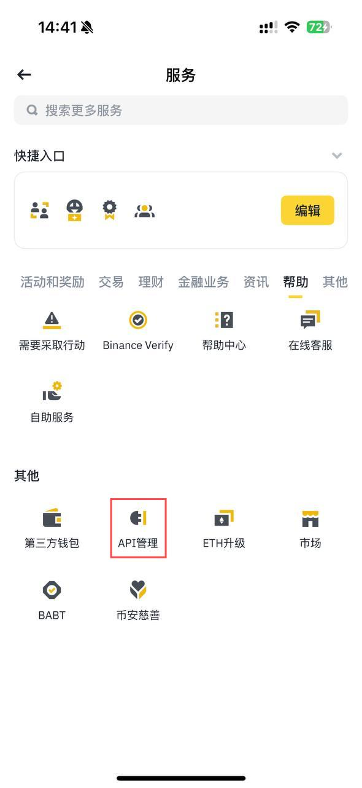
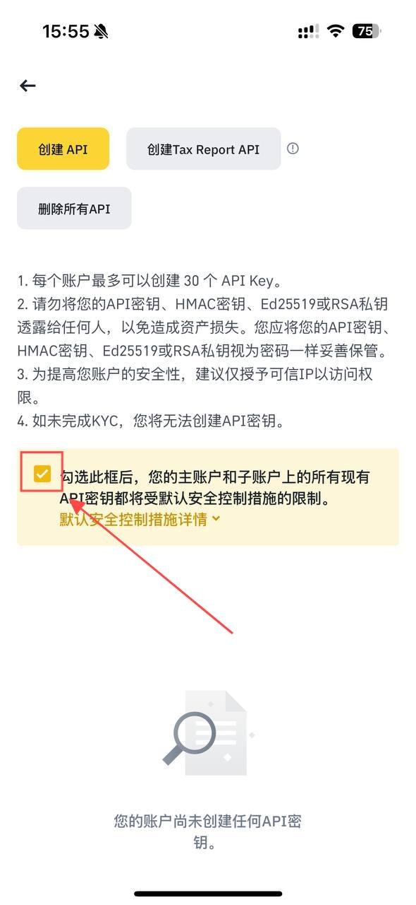
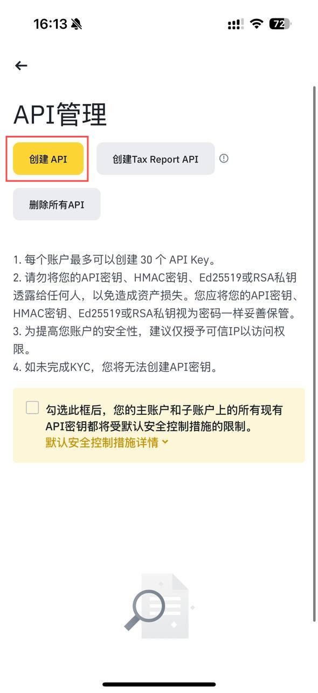
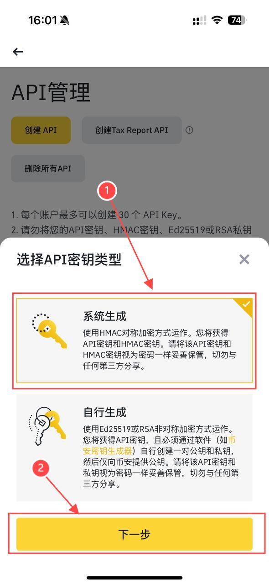
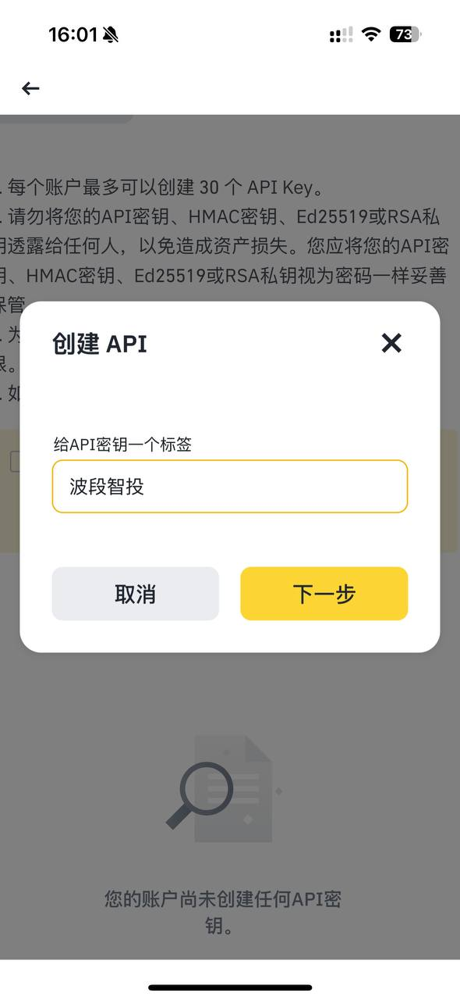
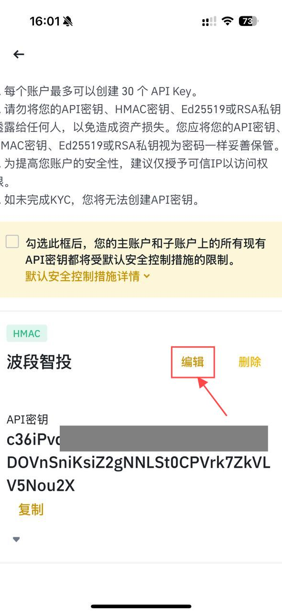
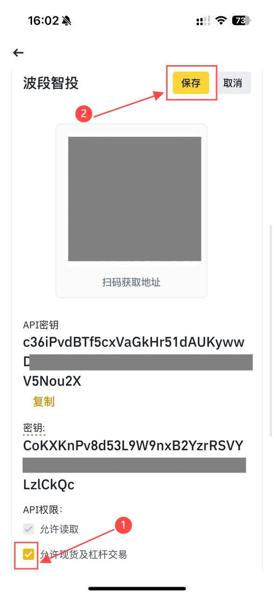

# 申请币安 API 密钥

::: warning 请注意，创建 API 密钥前，您需要：

- 启用账户的双重身份验证（2FA）；
- 向现货账户充值任意金额即可激活账户；
- 完成身份认证。
  :::

1. **登录币安 App 并进入币安`专业版`，然后点击`【更多】`打开`【服务】`面板。**

2. **下拉至`【其他】`部分，然后点击`【API 管理】`图标。**

3. **取消默认安全控制.**

4. **点击【创建 API】。**

5. **选择所需的 API 关键类型。**<Badge text="选择系统生成" />

6. **输入个人 API 的标签/名称。**

7. **编辑权限。**

8. **勾选现货允许现货和杠杆交易并保存**

::: tip 保存二维码,添加 key 需要使用
:::

<!--  -->
