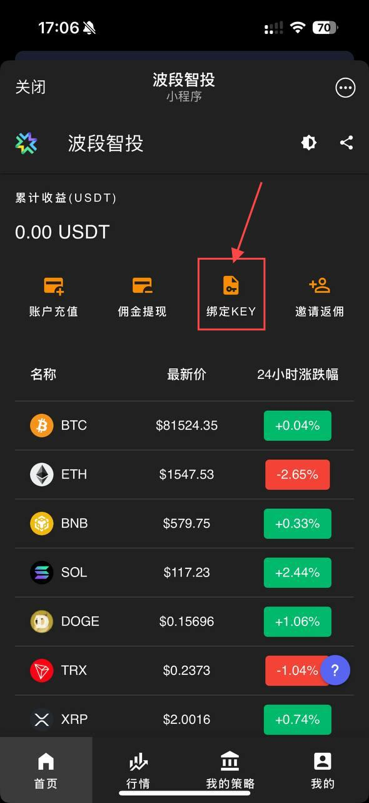
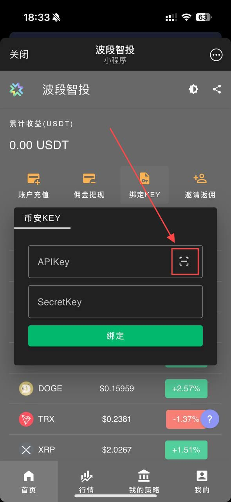
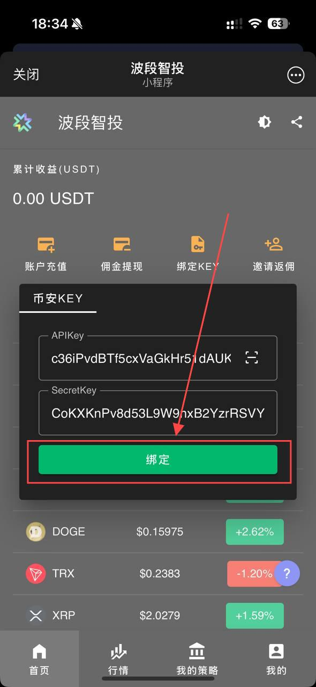
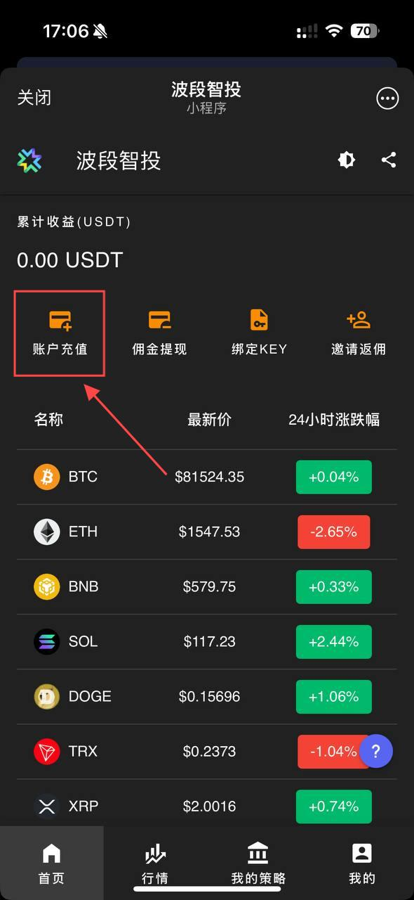
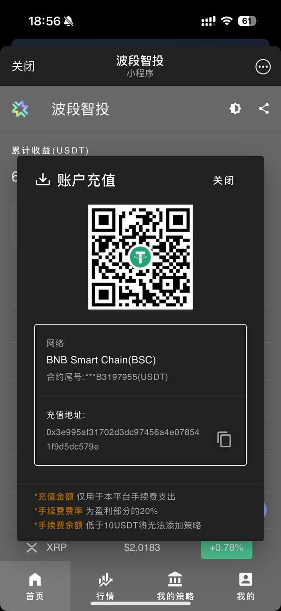
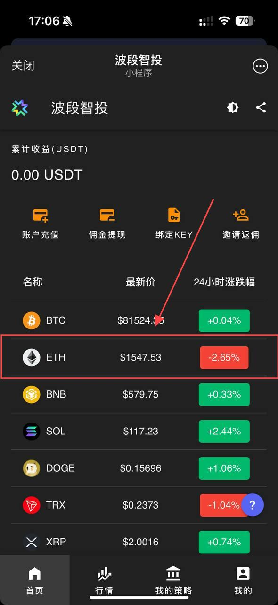
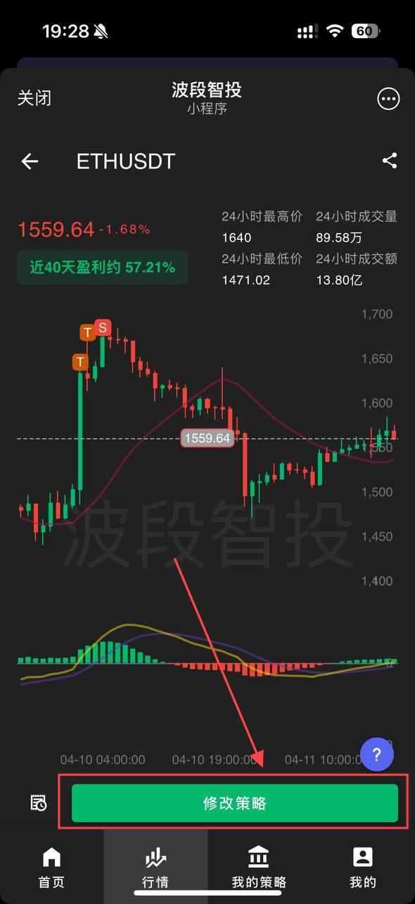
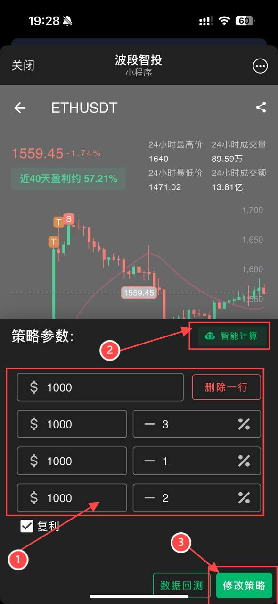
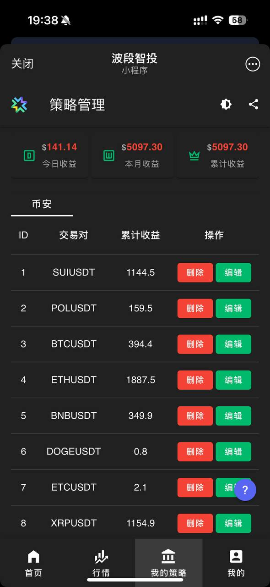

# 新手入门

## 1. 绑定 KEY

::: tip [币安 KEY 申请教程](hello.md)
:::

### 点击绑定 key

### 点击扫描或手动输入

### 绑定 key

## 2. 预充手续费

### 点击充值

::: tip 仅支持 bsc 网络

- 转账到获取的钱包地址
- 可使用钱包转账
- 也可交易所提现至此地址
  :::

::: warning 请注意:

- 如手续费余额低于 10U 将无法添加策略
- 如手续费不够支付手续费,交易将暂停
  :::

## 3. 添加策略

### 选择代币

### 编辑策略

### 添加策略

### 查看策略

